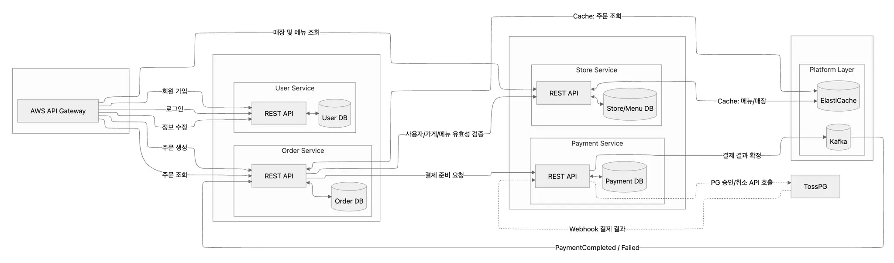
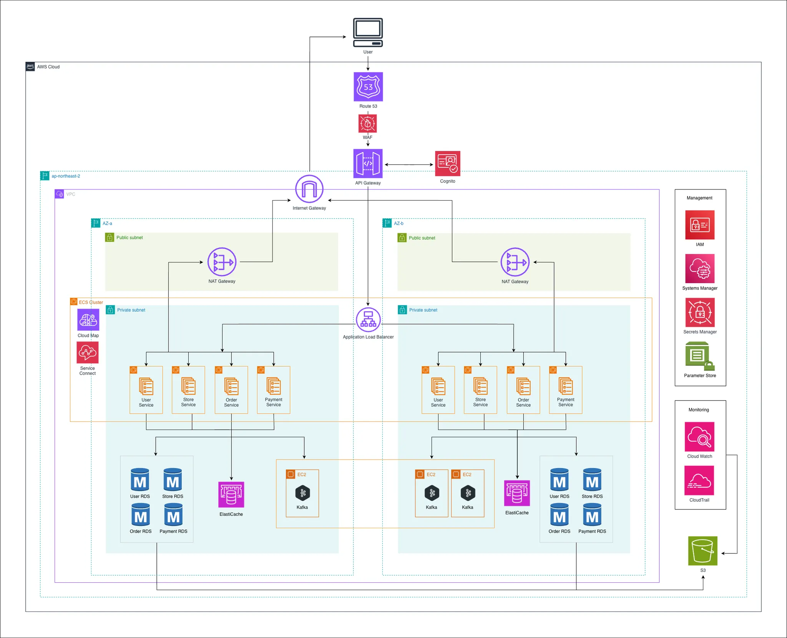

<div align="center">
 <h1> Spot </h1>
</div>

# version
- Spring Boot 3.5.9
- JDK 21


아래 명령어를 이용하여 convention을 지켜주세요
```bash
git config core.hooksPath .githooks
```

아래 명령어를 통해 쉽게 도커 컨테이너에서 사용할 수 있습니다.
```bash
./gradlew clean build -x test
docker-compose up --build -d
```

## Application Flow



### 서비스 구성
| 서비스 | 포트 | 역할 |
|--------|------|------|
| API Gateway | 8080 | 라우팅, 인증/인가 |
| User Service | 8081 | 회원 가입, 로그인, 정보 수정 |
| Order Service | 8082 | 주문 생성, 주문 조회 |
| Store Service | 8083 | 매장 및 메뉴 조회 |
| Payment Service | 8084 | 결제 처리, PG 연동 |

### 주요 흐름
1. **회원 관리**: API Gateway → User Service → User DB
2. **매장/메뉴 조회**: API Gateway → Store Service → Store/Menu DB (ElastiCache 캐싱)
3. **주문 생성**: API Gateway → Order Service → 사용자/가게/메뉴 유효성 검증 → Order DB
4. **결제 처리**: Order Service → Payment Service → TossPG 승인/취소 API 호출
5. **결제 결과**: TossPG Webhook → Payment Service → Kafka → 결제 결과 확정

### 서비스 간 통신
- **동기 통신**: OpenFeign을 통한 REST API 호출
- **비동기 통신**: Kafka를 통한 이벤트 기반 메시징
- **캐싱**: ElastiCache(Redis)를 통한 메뉴/매장 정보 캐싱


# Infrastructure
AWS Prod 환경입니다. 고가용성 배포를 위해 2중화를 고려한 설계입니다.



### 네트워크 구성
- **Region**: ap-northeast-2 (서울)
- **VPC**: 2개의 Availability Zone (AZ-a, AZ-b)으로 고가용성 확보
- **Public Subnet**: NAT Gateway 배치
- **Private Subnet**: ECS Cluster 및 애플리케이션 서비스 배치

### 트래픽 흐름
```
User → Route 53 → WAF → API Gateway → ALB → ECS Services
                         ↓
                      Cognito (인증)
```

### 컴퓨팅
- **ECS Cluster**: 각 AZ에 4개 서비스 (User, Store, Order, Payment) 이중화 배포
- **Service Connect & Cloud Map**: 서비스 간 통신 및 서비스 디스커버리
- **Application Load Balancer**: 트래픽 분산

### 데이터베이스
- **RDS**: 서비스별 독립 데이터베이스 (User, Store, Order, Payment)
- **ElastiCache**: Redis 캐시 클러스터
- **Kafka**: EC2 기반 3노드 클러스터 (메시지 브로커)

### 보안 및 관리
| 서비스 | 용도 |
|--------|------|
| IAM | 접근 권한 관리 |
| Cognito | 사용자 인증 |
| WAF | 웹 방화벽 |
| Secrets Manager | 비밀 정보 관리 |
| Parameter Store | 설정 값 관리 |

### 모니터링 및 스토리지
- **CloudWatch**: 로그 및 메트릭 모니터링
- **CloudTrail**: API 호출 감사 로그
- **S3**: 정적 파일 및 백업 스토리지