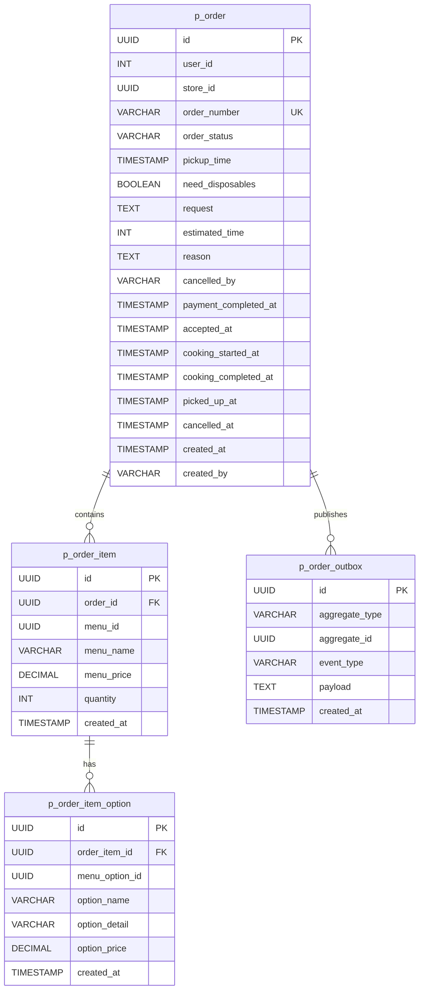
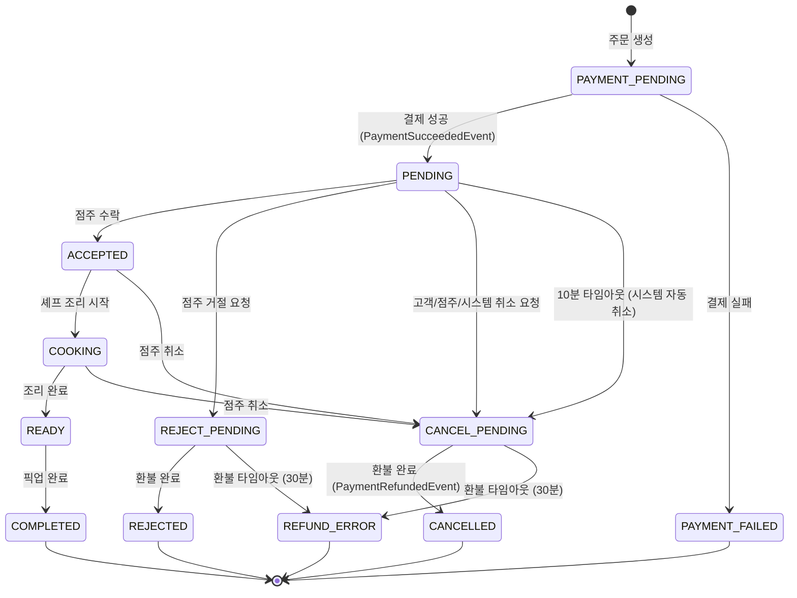
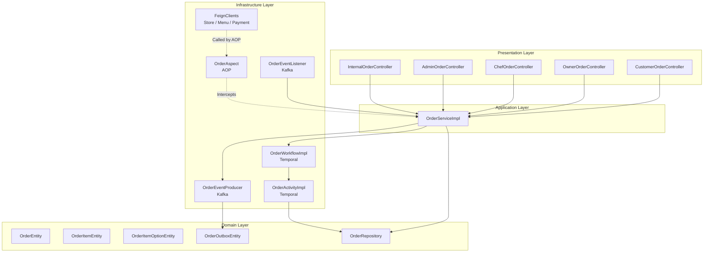
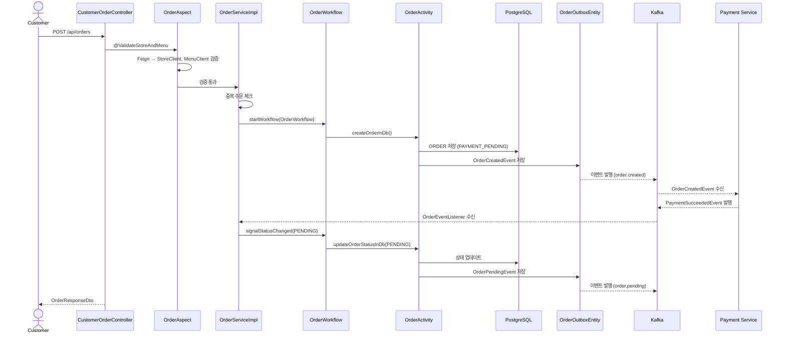
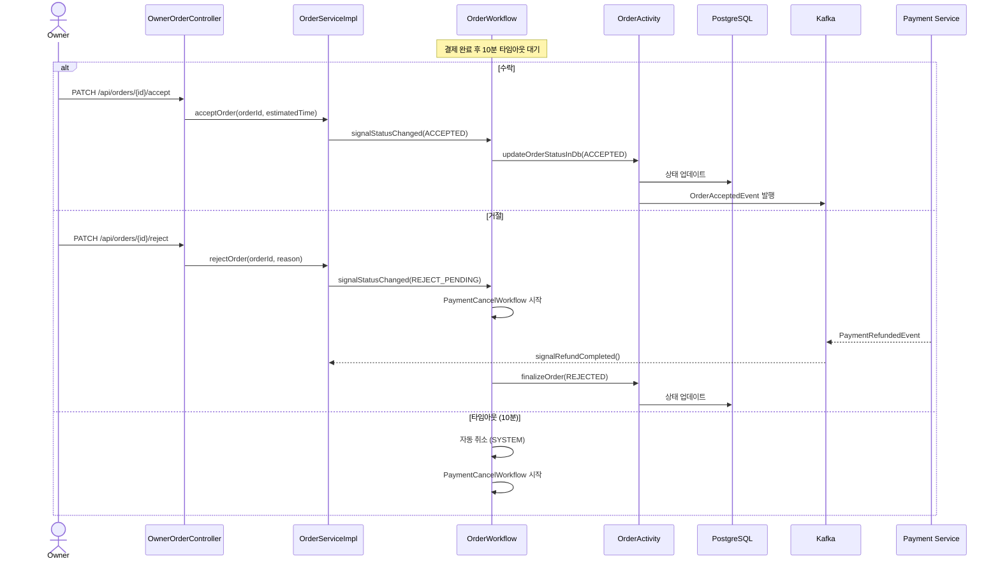
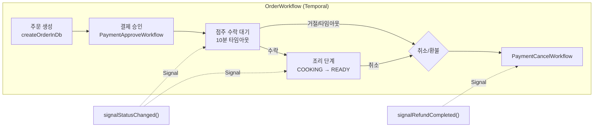
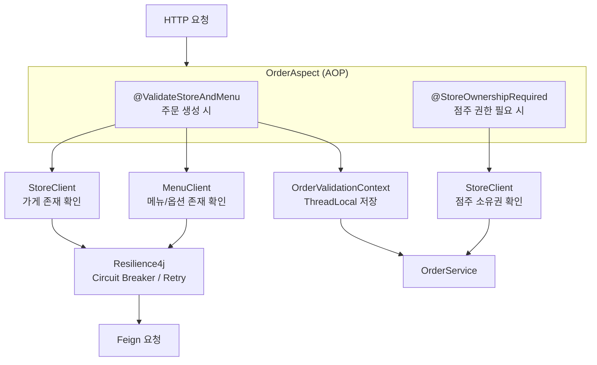
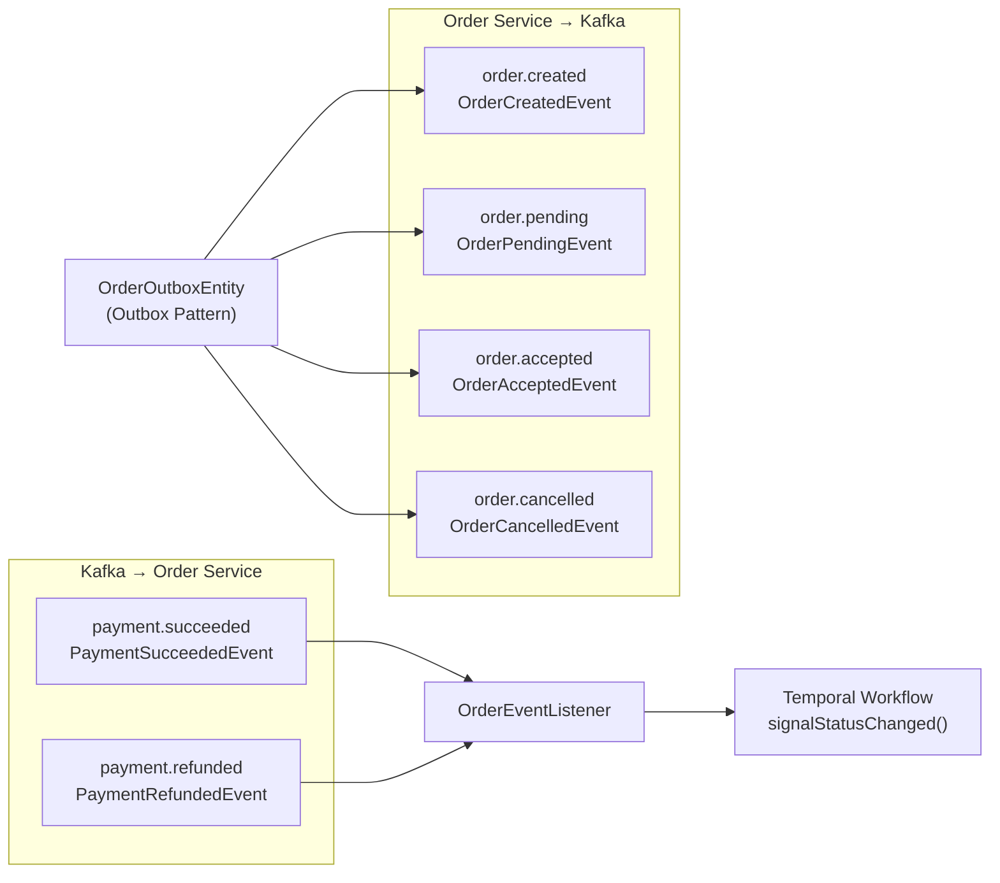

# Spot Order Service

주문 생성부터 완료/취소까지의 전체 라이프사이클을 관리하는 마이크로서비스입니다.
Temporal Workflow를 통한 분산 트랜잭션, Kafka Outbox Pattern 기반 이벤트 발행, Feign 기반 서비스 간 통신을 사용합니다.

---

## 기술 스택

| 항목 | 기술 |
|------|------|
| Language | Java 21 |
| Framework | Spring Boot 3.5.9 |
| Database | PostgreSQL, JPA/Hibernate |
| Workflow | Temporal 1.31.0 |
| Messaging | Apache Kafka (Outbox Pattern) |
| Service 통신 | OpenFeign |
| Cache | Redis |
| 인증 | JWT |
| Resilience | Resilience4j (Circuit Breaker, Retry, Bulkhead) |
| 모니터링 | Micrometer Prometheus |
| Container | Docker (Eclipse Temurin JRE 21) |

---

## 프로젝트 구조

```
spot-order/src/main/java/com/example/Spot/
├── SpotOrderApplication.java
├── order/
│   ├── domain/
│   │   ├── entity/          # JPA 엔티티
│   │   ├── enums/           # OrderStatus, CancelledBy
│   │   ├── exception/       # 도메인 예외
│   │   └── repository/      # JPA 레포지토리
│   ├── application/
│   │   └── service/         # OrderService, OrderServiceImpl
│   ├── infrastructure/
│   │   ├── temporal/        # Workflow & Activity
│   │   ├── event/           # 발행/구독 이벤트 DTO
│   │   ├── producer/        # Kafka 이벤트 발행
│   │   ├── listener/        # Kafka 이벤트 수신
│   │   └── aop/             # 검증, 권한 AOP
│   └── presentation/
│       ├── controller/      # 역할별 컨트롤러
│       └── dto/             # Request/Response DTO
├── internal/                # 서비스 간 Internal API
└── global/
    ├── feign/               # 외부 서비스 클라이언트
    ├── common/              # BaseEntity, Role
    └── infrastructure/      # Security, JWT, Redis, Swagger 설정
```

---

## 도메인 모델



---

## 주문 상태 흐름



---

## 레이어 아키텍처



---

## 주문 생성 플로우



---

## 주문 수락/거절/취소 플로우



---

## 취소/환불 플로우

```mermaid
sequenceDiagram
    actor Actor as Customer / Owner / System
    participant SVC as OrderServiceImpl
    participant Temporal as OrderWorkflow
    participant Activity as OrderActivity
    participant DB as PostgreSQL
    participant Payment as Payment Service
    participant Kafka as Kafka

    Actor->>SVC: cancelOrder(orderId, reason, cancelledBy)
    SVC->>Temporal: signalStatusChanged(CANCEL_PENDING)
    Temporal->>Activity: updateOrderStatusInDb(CANCEL_PENDING)
    Activity->>DB: 상태 업데이트

    Temporal->>Temporal: PaymentCancelWorkflow 시작
    Payment-->>Kafka: PaymentRefundedEvent 발행

    alt 환불 성공 (30분 이내)
        Kafka-->>SVC: OrderEventListener 수신
        SVC->>Temporal: signalRefundCompleted()
        Temporal->>Activity: finalizeOrder(CANCELLED)
        Activity->>DB: 상태 업데이트
        Activity->>Kafka: OrderCancelledEvent 발행
    else 환불 타임아웃 (30분)
        Temporal->>Activity: handleRefundTimeout()
        Activity->>DB: 상태 → REFUND_ERROR
    end
```

---

## Temporal Workflow 구조



---

## AOP 검증 흐름



---

## 이벤트 토픽 구조



---

## API 엔드포인트

### Customer (`CUSTOMER` 역할)

| Method | Path | 설명 |
|--------|------|------|
| POST | `/api/orders` | 주문 생성 |
| GET | `/api/orders/my` | 나의 주문 목록 (페이지네이션) |
| GET | `/api/orders/my/active` | 나의 활성 주문 |
| PATCH | `/api/orders/{orderId}/customer-cancel` | 주문 취소 |

### Owner (`OWNER` 역할)

| Method | Path | 설명 |
|--------|------|------|
| GET | `/api/orders/my-store` | 가게 주문 목록 (페이지네이션) |
| GET | `/api/orders/my-store/active` | 가게 활성 주문 |
| PATCH | `/api/orders/{orderId}/accept` | 주문 수락 (예상 시간 포함) |
| PATCH | `/api/orders/{orderId}/reject` | 주문 거절 (이유 포함) |
| PATCH | `/api/orders/{orderId}/store-cancel` | 가게 측 취소 |

### Chef (`CHEF` 역할)

| Method | Path | 설명 |
|--------|------|------|
| GET | `/api/orders/chef/today` | 오늘의 활성 주문 |
| PATCH | `/api/orders/{orderId}/start-cooking` | 조리 시작 |
| PATCH | `/api/orders/{orderId}/ready` | 조리 완료 (픽업 대기) |

### Admin (`MASTER` / `MANAGER` 역할)

| Method | Path | 설명 |
|--------|------|------|
| GET | `/api/admin/orders` | 전체 주문 목록 (필터/페이지) |
| GET | `/api/admin/orders/stats` | 주문 통계 |

### Internal (서비스 간 통신)

| Method | Path | 설명 |
|--------|------|------|
| GET | `/api/internal/orders/{orderId}` | 주문 상세 조회 |
| GET | `/api/internal/orders/{orderId}/exists` | 주문 존재 여부 확인 |

---

## 주요 설계 패턴

| 패턴 | 적용 위치 | 목적 |
|------|-----------|------|
| Temporal Workflow | `OrderWorkflowImpl` | 분산 트랜잭션 상태 머신 |
| Outbox Pattern | `OrderOutboxEntity` + `OrderEventProducer` | 이벤트 발행 신뢰성 보장 |
| Saga Pattern | Temporal Child Workflow | Payment 분산 트랜잭션 |
| Pessimistic Lock | `findByIdWithLock()` | 동시 상태 변경 방지 |
| AOP | `OrderAspect` | 검증/권한 횡단 관심사 분리 |
| Circuit Breaker | Resilience4j on Feign | 외부 서비스 장애 격리 |

---

## 실행 환경

- **Port**: 8082
- **Docker**: `eclipse-temurin:21-jre` 기반
- **외부 설정**: `/config/` 디렉터리의 `common.yml`, `kafka-topics.yml`, `spot-order.yml`
