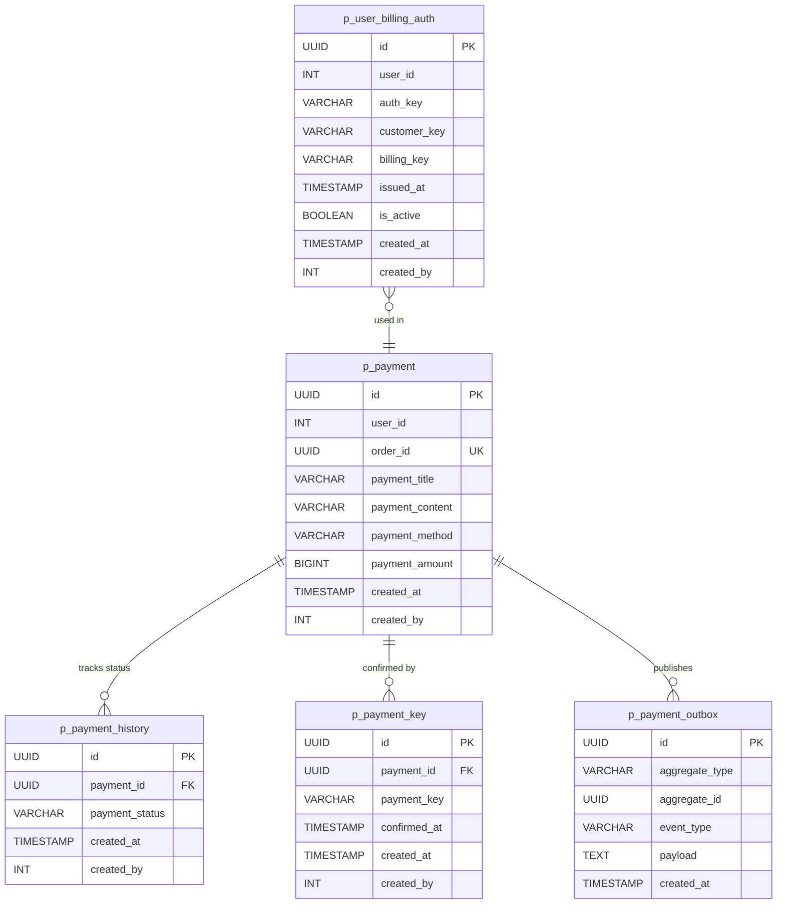
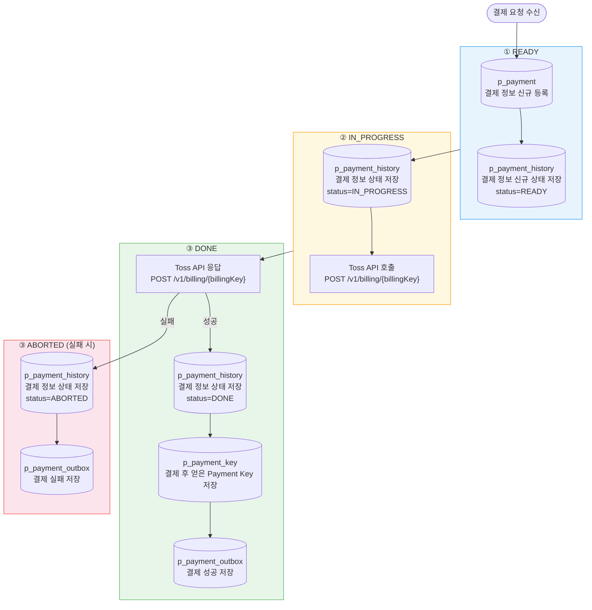
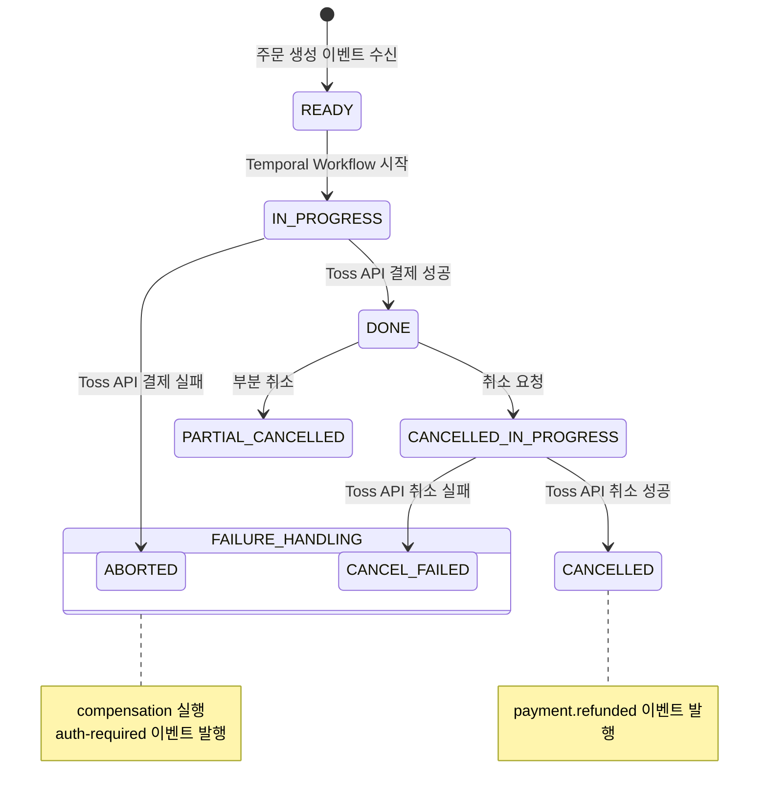
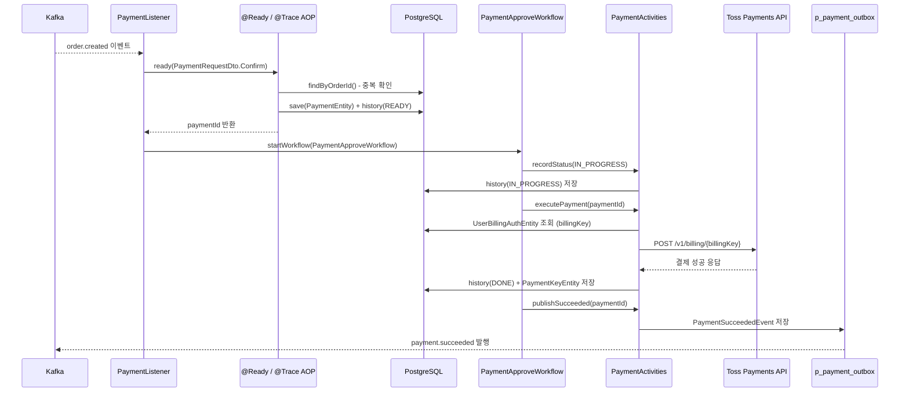
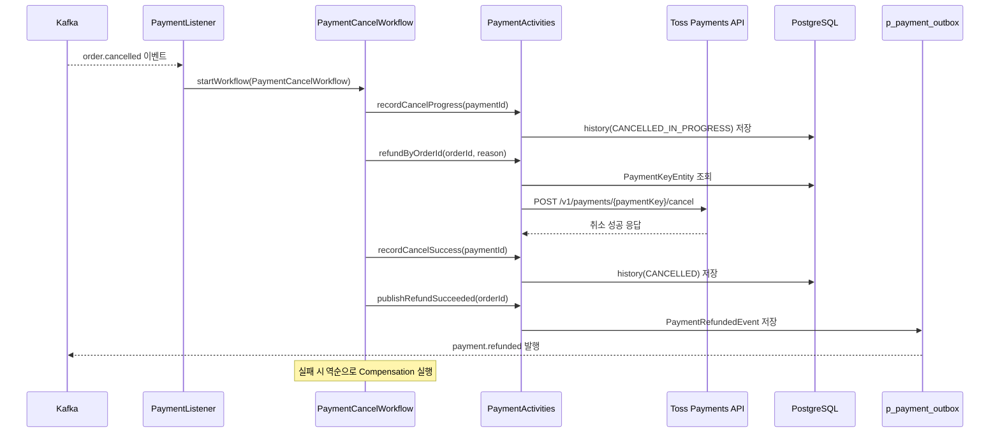
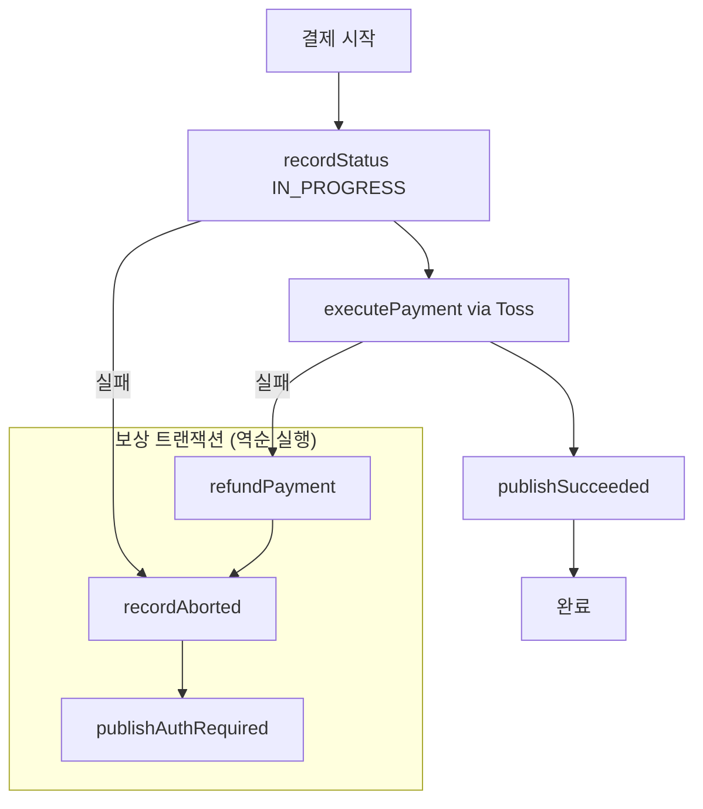
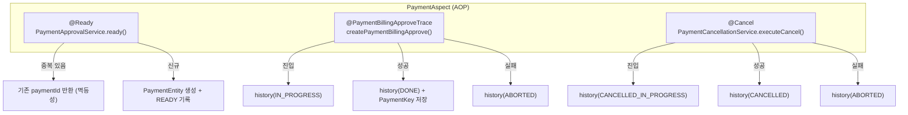
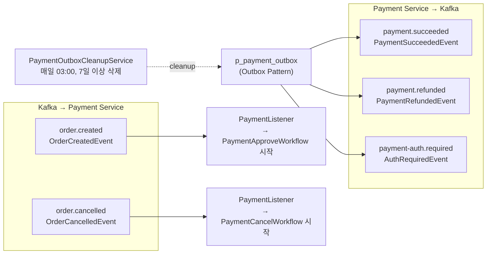
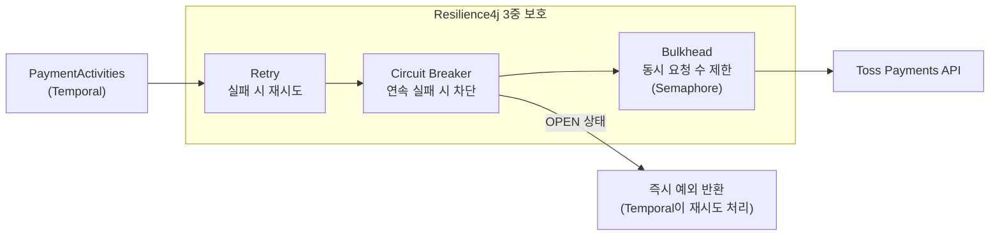
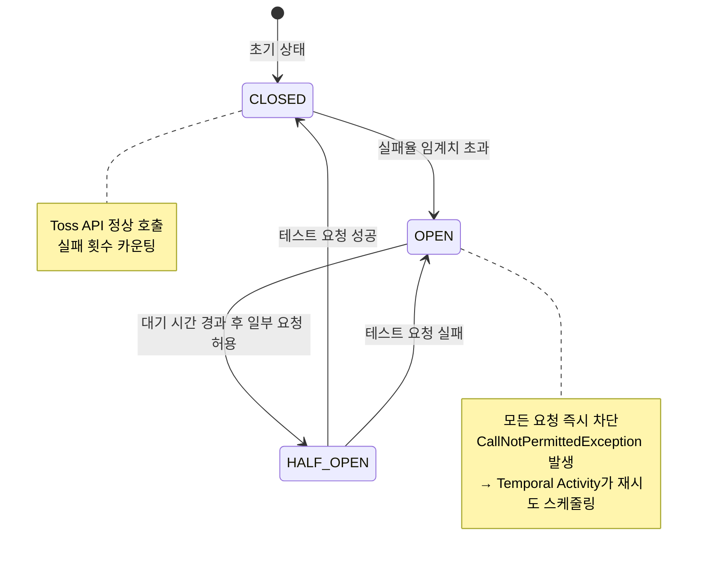

# Spot Payment Service

결제 승인, 취소, 환불을 담당하는 마이크로서비스입니다.
Toss Payments PG 연동, Temporal Workflow 기반 분산 트랜잭션(Saga), Kafka Outbox Pattern을 사용합니다.

---

## 기술 스택

| 항목 | 기술 |
|------|------|
| Language | Java 21 |
| Framework | Spring Boot 3.5.9 |
| Database | PostgreSQL, JPA/Hibernate |
| Workflow | Temporal 1.31.0 |
| Messaging | Apache Kafka (Outbox Pattern) |
| PG | Toss Payments API |
| Service 통신 | OpenFeign |
| Resilience | Resilience4j (Circuit Breaker, Retry, Bulkhead) |
| 모니터링 | Micrometer Prometheus |
| Container | Docker (Eclipse Temurin JRE 21) |

---

## 프로젝트 구조

```
spot-payment/src/main/java/com/example/Spot/payments/
├── application/service/
│   ├── command/              # PaymentApprovalService, PaymentCancellationService, BillingAuthService
│   ├── query/                # PaymentQueryService
│   ├── PaymentService.java   # Facade
│   ├── PaymentHistoryService.java
│   └── PaymentOutboxCleanupService.java
├── domain/
│   ├── entity/               # PaymentEntity, PaymentHistoryEntity, PaymentKeyEntity
│   │                         # PaymentOutboxEntity, UserBillingAuthEntity
│   ├── repository/           # 각 엔티티별 Repository
│   └── gateway/
│       └── PaymentGateway.java  # Toss API 추상화 인터페이스
└── infrastructure/
    ├── aop/                  # PaymentAspect, @Ready, @PaymentBillingApproveTrace, @Cancel
    ├── client/               # TossPaymentClient (implements PaymentGateway)
    ├── event/                # 발행/구독 이벤트 DTO
    ├── listener/             # PaymentListener (Kafka Consumer)
    ├── producer/             # PaymentEventProducer (Outbox)
    └── temporal/             # PaymentApproveWorkflow, PaymentCancelWorkflow, Activities
```

---

## 도메인 모델



---

## 결제 상태별 테이블 저장 순서



> `p_payment_history`는 상태가 바뀔 때마다 **행이 추가(INSERT)**됩니다. UPDATE가 아닌 append-only 구조로 전체 이력이 보존됩니다.

---

## 결제 상태 흐름



---

## 결제 승인 플로우



---

## 결제 취소/환불 플로우



---

## Temporal Saga 보상 트랜잭션



---

## AOP 상태 관리



---

## Outbox Pattern 이벤트 흐름



---

## Resilience4j — Toss Payments 장애 격리

`TossPaymentClient`의 모든 Toss API 호출에 **Circuit Breaker + Bulkhead + Retry** 3중 보호가 적용됩니다.

### 적용 위치

| 인스턴스명 | 적용 메서드 | Toss API |
|-----------|------------|----------|
| `toss_billing_payment` | `requestBillingPayment()` | `POST /v1/billing/{billingKey}` |
| `toss_payment_cancel` | `cancelPayment()` | `POST /v1/payments/{paymentKey}/cancel` |
| `toss_payment_partial_cancel` | `cancelPaymentPartial()` | `POST /v1/payments/{paymentKey}/cancel` |
| `toss_billing_key_issue` | `issueBillingKey()` | `POST /v1/billing/authorizations/issue` |

```java
// TossPaymentClient.java 실제 적용 예시
@CircuitBreaker(name = "toss_billing_payment")
@Bulkhead(name = "toss_billing_payment", type = Bulkhead.Type.SEMAPHORE)
@Retry(name = "toss_billing_payment")
public TossPaymentResponse requestBillingPayment(...) { ... }
```

### 각 패턴의 역할



### Circuit Breaker 상태 전환



### Temporal과의 연동

Circuit Breaker가 `OPEN` 상태일 때 Toss API 호출이 차단되면,
Temporal Activity가 예외를 받아 **자체 재시도 스케줄러**로 넘깁니다.

```
Toss API 장애 발생
    → Circuit Breaker OPEN (즉시 차단)
    → Temporal Activity 실패
    → Temporal 재시도 (초기 10초 → 최대 1분 간격, 최대 6회)
    → Circuit Breaker HALF_OPEN 전환 후 복구 감지
    → 결제 재시도 성공
```

Resilience4j와 Temporal의 재시도가 **이중으로** 동작하여,
단순 네트워크 순단은 Resilience4j Retry가, 장시간 장애는 Temporal이 처리합니다.

---

## 외부 서비스 연동 (Feign)

```mermaid
graph LR
    subgraph PaymentService["Spot Payment Service"]
        OC[OrderClient]
        SC[StoreClient]
        UC[UserClient]
    end

    OC -->|GET /api/internal/orders/{orderId}| OS["Spot Order Service"]
    OC -->|GET /api/internal/orders/{orderId}/exists| OS

    SC -->|GET /api/internal/store-users/exists| SS["Spot Store Service"]
    SC -->|GET /api/internal/store-users/by-user| SS

    UC -->|GET /api/internal/users/{userId}| US["Spot User Service"]
    UC -->|GET /api/internal/users/{userId}/exists| US
```

---

## API 엔드포인트

### 결제 (`/api/payments`)

| Method | Path | 권한 | 설명 |
|--------|------|------|------|
| POST | `/api/payments/{orderId}/confirm` | CUSTOMER/OWNER/MANAGER/MASTER | 결제 승인 실행 |
| POST | `/api/payments/{orderId}/cancel` | CUSTOMER/OWNER/MANAGER/MASTER | 결제 취소 |
| GET | `/api/payments` | MANAGER/MASTER | 전체 결제 목록 |
| GET | `/api/payments/{paymentId}` | CUSTOMER/OWNER/MANAGER/MASTER | 결제 상세 조회 |
| GET | `/api/payments/cancel` | MANAGER/MASTER | 전체 취소 목록 |
| GET | `/api/payments/{paymentId}/cancel` | CUSTOMER/OWNER/MANAGER/MASTER | 결제별 취소 내역 |
| POST | `/api/payments/billing-key` | 없음 | 빌링키 등록 (authKey → billingKey) |
| GET | `/api/payments/billing-key/exists` | CUSTOMER/OWNER/MANAGER/MASTER | 빌링키 보유 여부 |
| POST | `/api/payments/history` | CUSTOMER/OWNER/MANAGER/MASTER | FE 콜백 결제 이력 저장 |

### Internal (서비스 간 통신)

| Method | Path | 설명 |
|--------|------|------|
| GET | `/api/internal/payments/order/{orderId}` | 주문 ID로 결제 조회 |
| GET | `/api/internal/payments/order/{orderId}/exists` | 활성 결제 존재 여부 |
| POST | `/api/internal/payments/{paymentId}/cancel` | 내부 결제 취소 |

---

## Temporal Workflow 설정

| 항목 | PaymentApproveWorkflow | PaymentCancelWorkflow |
|------|------------------------|----------------------|
| Task Queue | PAYMENT_TASK_QUEUE | PAYMENT_TASK_QUEUE |
| Workflow ID | `payment-wf-{orderId}` | `cancel-wf-{orderId}` |
| 초기 재시도 간격 | 10초 | 5초 |
| 최대 재시도 간격 | 1분 | 3분 |
| 최대 시도 횟수 | 6회 | 15회 (환불은 더 관대) |
| 재시도 제외 예외 | BillingKeyNotFoundException | BillingKeyNotFoundException |
| ID 재사용 정책 | ALLOW_DUPLICATE_FAILED_ONLY | ALLOW_DUPLICATE_FAILED_ONLY |

---

## 주요 설계 패턴

| 패턴 | 적용 위치 | 목적 |
|------|-----------|------|
| Outbox Pattern | PaymentOutboxEntity + PaymentEventProducer | 이벤트 발행 신뢰성 보장 |
| Saga Pattern | Temporal Workflow + Compensation | 분산 트랜잭션 일관성 |
| Idempotency | @Ready AOP + Temporal ID 정책 | 중복 결제 방지 |
| Circuit Breaker | Resilience4j (Toss, User) | 외부 서비스 장애 격리 |
| AOP | PaymentAspect | 상태 전환 횡단 관심사 분리 |
| CQRS | command/ vs query/ 분리 | 읽기/쓰기 책임 분리 |
| Gateway | PaymentGateway 인터페이스 | PG사 교체 용이성 확보 |

---

## 실행 환경

- **Port**: 8084 (기본)
- **Docker**: `eclipse-temurin:21-jre` 기반
- **외부 설정**: `/config/` 디렉터리의 `common.yml`, `kafka-topics.yml`, `spot-payment.yml`
- **Outbox 정리**: 매일 03:00, 7일 이상 된 레코드 자동 삭제
