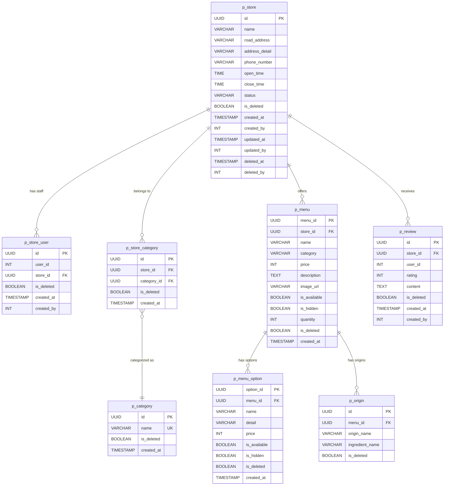
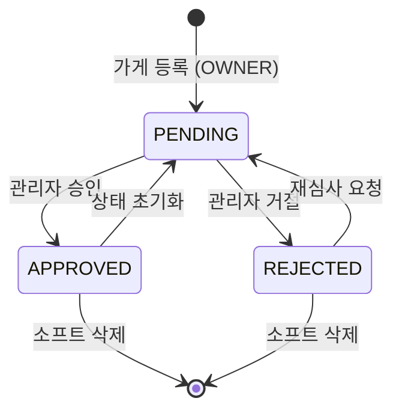
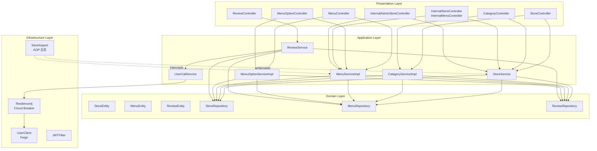
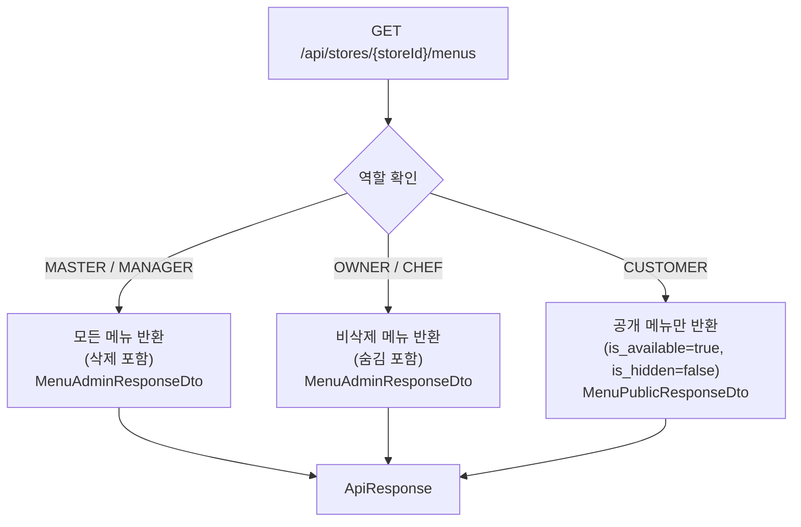
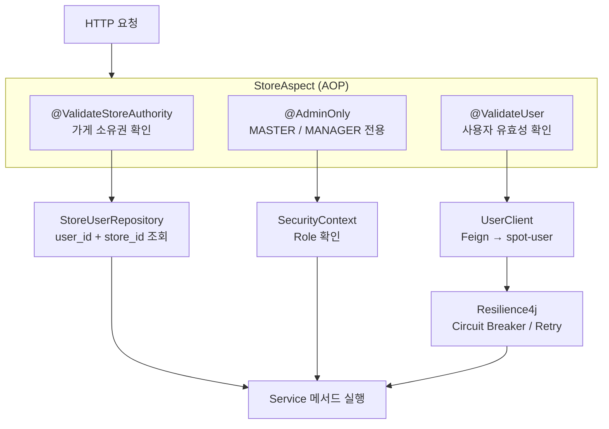
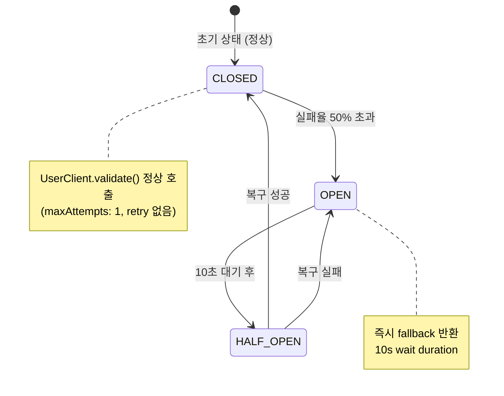
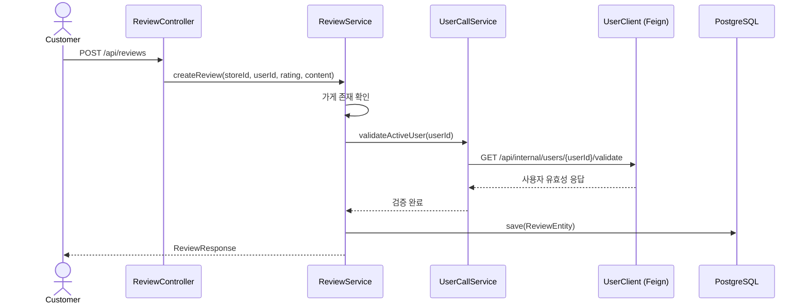

# Spot Store Service

가게, 메뉴, 리뷰, 카테고리를 관리하는 마이크로서비스입니다.
역할 기반 메뉴 가시성, AOP 권한 검증, Resilience4j를 통한 외부 서비스 장애 격리를 제공합니다.

---

## 기술 스택

| 항목 | 기술 |
|------|------|
| Language | Java 21 |
| Framework | Spring Boot 3.5.9 |
| Database | PostgreSQL, JPA/Hibernate |
| 인증 | JWT |
| Cache | Redis |
| Service 통신 | OpenFeign |
| Resilience | Resilience4j (Circuit Breaker, Retry, Bulkhead) |
| 모니터링 | Micrometer Prometheus |
| Container | Docker (Eclipse Temurin JRE 21) |

---

## 프로젝트 구조

```
spot-store/src/main/java/com/example/Spot/
├── SpotStoreApplication.java
├── store/
│   ├── domain/
│   │   ├── entity/           # StoreEntity, StoreUserEntity, StoreCategoryEntity, CategoryEntity
│   │   ├── repository/       # StoreRepository, StoreUserRepository, CategoryRepository
│   │   └── StoreStatus.java  # PENDING, APPROVED, REJECTED
│   ├── application/service/  # StoreService, CategoryService, UserCallService
│   ├── infrastructure/
│   │   └── aop/              # StoreAspect, @ValidateStoreAuthority, @AdminOnly, @ValidateUser
│   └── presentation/
│       ├── controller/        # StoreController, CategoryController
│       └── dto/               # Request/Response DTO
├── menu/
│   ├── domain/
│   │   ├── entity/           # MenuEntity, MenuOptionEntity, OriginEntity
│   │   └── repository/       # MenuRepository, MenuOptionRepository
│   ├── application/service/  # MenuService, MenuOptionService
│   └── presentation/
│       ├── controller/        # MenuController, MenuOptionController
│       └── dto/               # 역할별 Response DTO (Public/Admin/Owner)
├── review/
│   ├── domain/
│   │   ├── entity/           # ReviewEntity
│   │   └── repository/       # ReviewRepository
│   ├── application/service/  # ReviewService
│   └── presentation/
│       ├── controller/        # ReviewController
│       └── dto/               # ReviewCreateRequest, ReviewResponse, ReviewStatsResponse
├── internal/                  # 서비스 간 Internal API
└── global/
    ├── feign/                 # UserClient (spot-user)
    ├── common/                # BaseEntity, UpdateBaseEntity, Role
    └── infrastructure/        # Security, JWT, Redis, Swagger 설정
```

---

## 도메인 모델



---

## 가게 상태 흐름



---

## 레이어 아키텍처



---

## 메뉴 가시성 전략



---

## AOP 권한 검증 흐름



---

## Circuit Breaker 동작



---

## 리뷰 흐름



---

## 외부 서비스 연동 (Feign)

```mermaid
graph LR
    subgraph StoreService["Spot Store Service"]
        UC[UserClient]
        UCS[UserCallService<br/>Circuit Breaker 적용]
    end

    UC -->|GET /api/users/{userId}| US["Spot User Service"]
    UC -->|GET /api/internal/users/{userId}/validate| US

    subgraph Internal["Internal API (서비스 → Store)"]
        direction TB
        IS["/api/internal/stores/{id}"]
        ISU["/api/internal/store-users/by-user"]
        IM["/api/internal/menus/{id}"]
        IMO["/api/internal/menu-options/{id}"]
        IAN["/api/internal/admin/stores/names"]
    end

    OrderSvc["Spot Order Service"] -->|Store/Menu 정보 조회| Internal
    UserSvc["Spot User Service"] -->|가게명 배치 조회| IAN
```

---

## API 엔드포인트

### 가게 (`/api/stores`)

| Method | Path | 권한 | 설명 |
|--------|------|------|------|
| POST | `/api/stores` | OWNER/MANAGER/MASTER | 가게 등록 (PENDING 상태) |
| GET | `/api/stores` | 인증 필요 | 전체 가게 목록 (페이지) |
| GET | `/api/stores/my` | OWNER/CHEF | 내 가게 목록 |
| GET | `/api/stores/{storeId}` | 인증 필요 | 가게 상세 조회 |
| GET | `/api/stores/search` | 인증 필요 | 가게 이름 검색 |
| PATCH | `/api/stores/{storeId}` | OWNER/MANAGER/MASTER | 가게 정보 수정 |
| PATCH | `/api/stores/{storeId}/staff` | OWNER/MANAGER/MASTER | 직원 추가/제거 |
| PATCH | `/api/stores/{storeId}/status` | MANAGER/MASTER | 승인 상태 변경 |
| DELETE | `/api/stores/{storeId}` | OWNER/MANAGER/MASTER | 가게 삭제 (소프트) |

### 카테고리 (`/api/categories`)

| Method | Path | 권한 | 설명 |
|--------|------|------|------|
| GET | `/api/categories` | 없음 | 전체 카테고리 조회 |
| GET | `/api/categories/{name}/stores` | 없음 | 카테고리별 가게 목록 |
| POST | `/api/categories` | OWNER/MANAGER/MASTER | 카테고리 생성 |
| PATCH | `/api/categories/{categoryId}` | MANAGER/MASTER | 카테고리 수정 |
| DELETE | `/api/categories/{categoryId}` | MANAGER/MASTER | 카테고리 삭제 |

### 메뉴 (`/api/stores/{storeId}/menus`)

| Method | Path | 권한 | 설명 |
|--------|------|------|------|
| GET | `/api/stores/{storeId}/menus` | 역할별 필터링 | 메뉴 목록 (역할별 가시성) |
| GET | `/api/stores/{storeId}/menus/{menuId}` | 인증 필요 | 메뉴 상세 |
| POST | `/api/stores/{storeId}/menus` | OWNER/MANAGER/MASTER | 메뉴 생성 |
| PATCH | `/api/stores/{storeId}/menus/{menuId}` | OWNER/MANAGER/MASTER | 메뉴 수정 |
| PATCH | `/api/stores/{storeId}/menus/{menuId}/hide` | OWNER/MANAGER/MASTER | 메뉴 숨김 토글 |
| DELETE | `/api/stores/{storeId}/menus/{menuId}` | OWNER/MANAGER/MASTER | 메뉴 삭제 |

### 메뉴 옵션 (`/api/stores/{storeId}/menus/{menuId}/options`)

| Method | Path | 권한 | 설명 |
|--------|------|------|------|
| POST | `.../options` | OWNER/MANAGER/MASTER | 옵션 생성 |
| PATCH | `.../options/{optionId}` | OWNER/MANAGER/MASTER | 옵션 수정 |
| PATCH | `.../options/{optionId}/hide` | OWNER/MANAGER/MASTER | 옵션 숨김 토글 |
| DELETE | `.../options/{optionId}` | OWNER/MANAGER/MASTER | 옵션 삭제 |

### 리뷰 (`/api/reviews`)

| Method | Path | 권한 | 설명 |
|--------|------|------|------|
| POST | `/api/reviews` | 인증 필요 | 리뷰 작성 |
| GET | `/api/reviews/stores/{storeId}` | 없음 | 가게 리뷰 목록 |
| GET | `/api/reviews/stores/{storeId}/stats` | 없음 | 평균 평점 및 리뷰 수 |
| PATCH | `/api/reviews/{reviewId}` | 본인 | 리뷰 수정 |
| DELETE | `/api/reviews/{reviewId}` | 본인 또는 MASTER/MANAGER | 리뷰 삭제 |

### Internal (서비스 간 통신)

| Method | Path | 설명 |
|--------|------|------|
| GET | `/api/internal/stores/{storeId}` | 가게 정보 조회 |
| GET | `/api/internal/stores/{storeId}/exists` | 가게 존재 여부 |
| GET | `/api/internal/store-users/by-user` | userId로 가게 조회 |
| GET | `/api/internal/store-users/exists` | 직원 여부 확인 |
| GET | `/api/internal/menus/{menuId}` | 메뉴 정보 조회 |
| GET | `/api/internal/menus/{menuId}/exists` | 메뉴 존재 여부 |
| GET | `/api/internal/menu-options/{optionId}` | 메뉴 옵션 조회 |
| GET | `/api/internal/admin/stores/names` | 가게명 배치 조회 (IDs) |

---

## 주요 설계 패턴

| 패턴 | 적용 위치 | 목적 |
|------|-----------|------|
| AOP | StoreAspect | 권한 검증 횡단 관심사 분리 |
| Soft Delete | UpdateBaseEntity | 데이터 보존 삭제 (audit trail 유지) |
| Strategy | MenuResponseDto (Public/Admin) | 역할별 메뉴 노출 전략 |
| Circuit Breaker | UserCallService | spot-user 장애 격리 |
| Pessimistic Lock | 가게 상태 변경 | 동시 승인 처리 방지 |
| JPA Auditing | BaseEntity | created_by/at, updated_by/at 자동 추적 |
| Factory Method | DTO.fromEntity() | 엔티티 → DTO 변환 일관성 |

---

## 실행 환경

- **Port**: 8083
- **Docker**: `eclipse-temurin:21-jre` 기반
- **외부 설정**: `/config/` 디렉터리의 `common.yml`, `spot-store.yml`
- **서비스 지역 필터**: `service.active-regions: 종로구`
