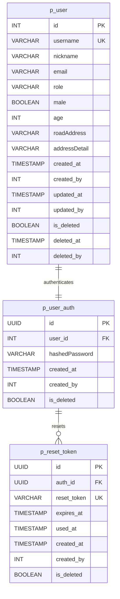
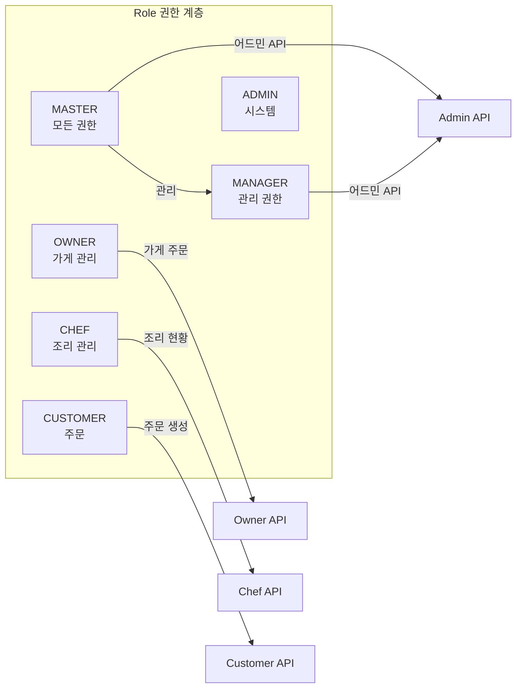
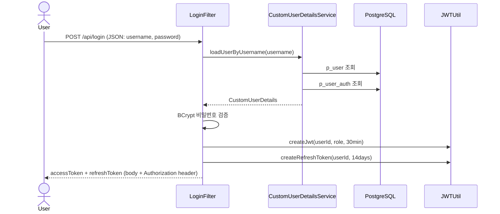
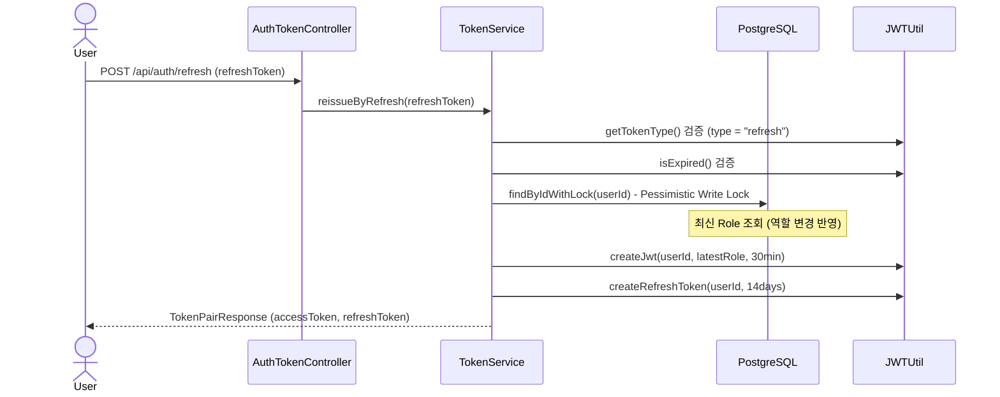
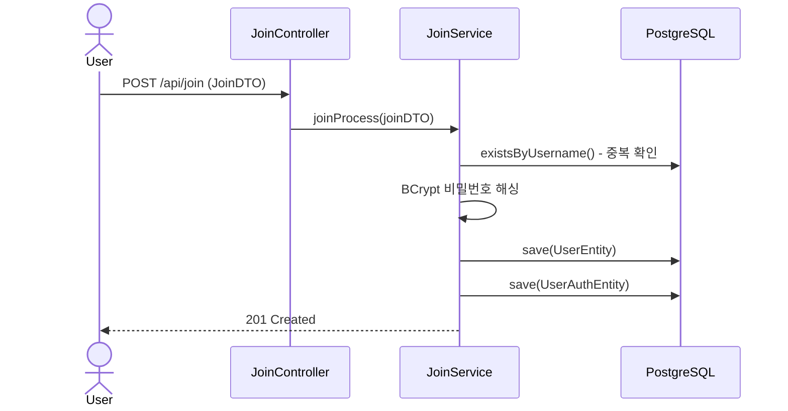
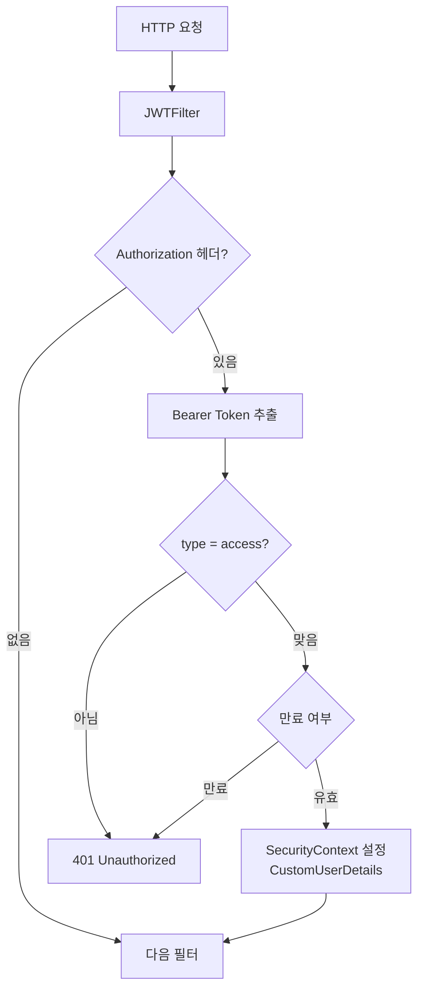
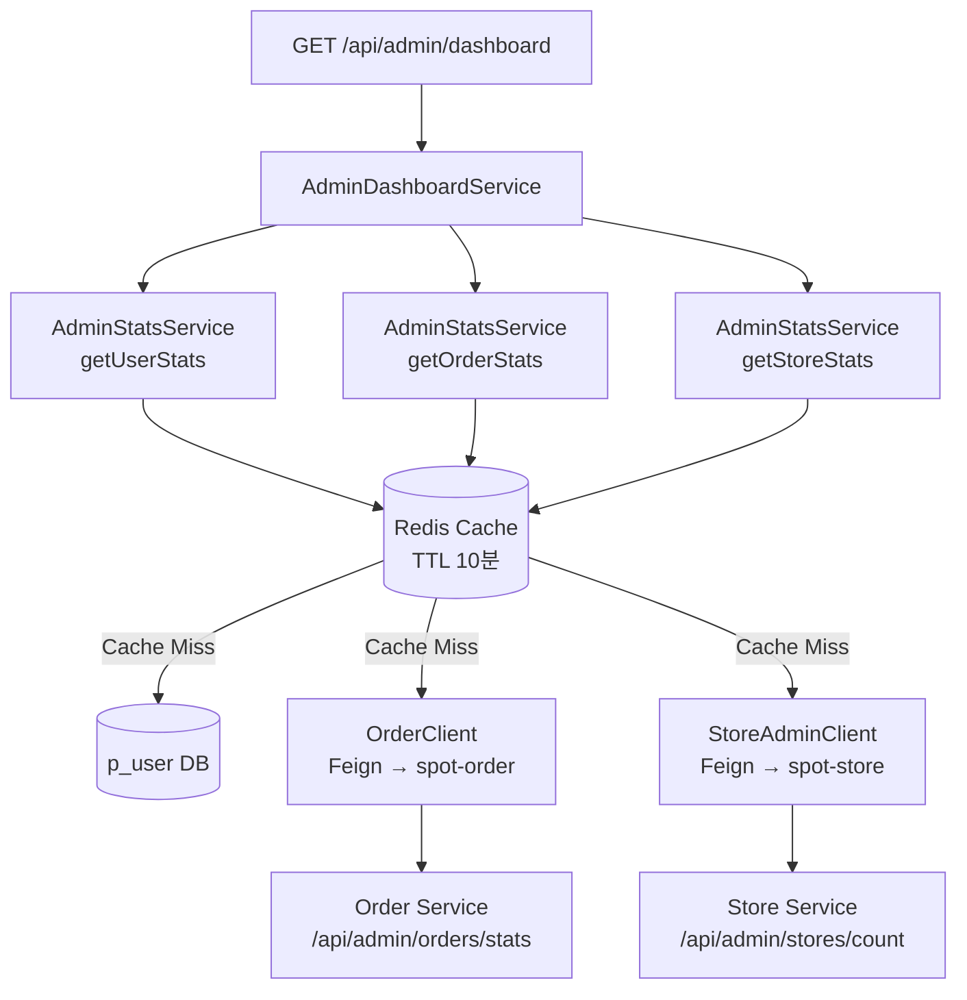
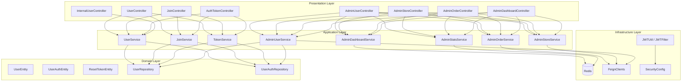

# Spot User Service

사용자 인증, 회원 관리, 어드민 대시보드를 담당하는 마이크로서비스입니다.
JWT 기반 인증, Redis 캐싱, Feign을 통한 Order/Store 서비스 연동을 제공합니다.

---

## 기술 스택

| 항목 | 기술 |
|------|------|
| Language | Java 21 |
| Framework | Spring Boot 3.5.9 |
| Database | PostgreSQL, JPA/Hibernate |
| 인증 | JWT (jjwt 0.12.6) |
| Cache | Redis |
| Service 통신 | OpenFeign |
| Resilience | Resilience4j |
| 모니터링 | Micrometer Prometheus |
| Container | Docker (Eclipse Temurin JRE 21) |

---

## 프로젝트 구조

```
spot-user/src/main/java/com/example/Spot/
├── SpotUserApplication.java
├── user/
│   ├── domain/
│   │   ├── entity/           # UserEntity, UserAuthEntity, ResetTokenEntity
│   │   ├── Role.java         # ADMIN, CUSTOMER, OWNER, CHEF, MANAGER, MASTER
│   │   └── repository/       # UserRepository, UserAuthRepository
│   ├── application/
│   │   └── service/          # UserService, JoinService, TokenService
│   └── presentation/
│       ├── controller/        # UserController, JoinController, AuthTokenController
│       └── dto/               # Request/Response DTO
├── admin/
│   ├── application/service/   # AdminUserService, AdminStoreService, AdminOrderService
│   │                          # AdminStatsService, AdminDashboardService
│   └── presentation/
│       ├── controller/        # Admin 역할별 컨트롤러
│       └── dto/               # AdminStatsResponseDto
├── auth/
│   ├── jwt/                   # JWTFilter, JWTUtil, LoginFilter
│   └── security/              # CustomUserDetails, CustomUserDetailsService
├── internal/                  # 서비스 간 Internal API
└── global/
    ├── feign/                 # OrderClient, StoreClient, StoreAdminClient
    ├── common/                # BaseEntity, UpdateBaseEntity, AuditorAwareImpl
    └── infrastructure/        # Security, Redis, Swagger 설정
```

---

## 도메인 모델



---

## 사용자 역할



---

## 인증 흐름



---

## 토큰 갱신 흐름



---

## 회원가입 흐름



---

## JWT 필터 동작



---

## 어드민 대시보드 아키텍처



---

## 레이어 아키텍처



---

## 외부 서비스 연동 (Feign)

```mermaid
graph LR
    subgraph UserService["Spot User Service"]
        OC[OrderClient]
        SC[StoreClient]
        SAC[StoreAdminClient]
    end

    OC -->|GET /api/admin/orders| OS["Spot Order Service"]
    OC -->|GET /api/admin/orders/stats| OS
    OC -->|GET /api/admin/orders/count| OS

    SC -->|GET /api/stores/{id}| SS["Spot Store Service"]
    SAC -->|GET /api/admin/stores| SS
    SAC -->|PATCH /api/admin/stores/{id}/approve| SS
    SAC -->|DELETE /api/admin/stores/{id}| SS
    SAC -->|GET /api/admin/stores/count| SS
    SAC -->|POST /api/internal/stores/names| SS
```

---

## API 엔드포인트

### 인증

| Method | Path | 인증 | 설명 |
|--------|------|------|------|
| POST | `/api/join` | 없음 | 회원가입 |
| POST | `/api/login` | 없음 | 로그인 (access + refresh 토큰 발급) |
| POST | `/api/auth/refresh` | 없음 | 토큰 갱신 |
| POST | `/api/auth/logout` | 인증 필요 | 로그아웃 |

### 사용자 관리 (`/api/users`)

| Method | Path | 인증 | 설명 |
|--------|------|------|------|
| GET | `/api/users/{userId}` | 본인 또는 MASTER/MANAGER | 사용자 조회 |
| PATCH | `/api/users/{userId}` | 본인 또는 MASTER/MANAGER | 사용자 정보 수정 |
| DELETE | `/api/users/me` | 인증 필요 | 회원 탈퇴 (소프트 삭제) |
| GET | `/api/users/search` | MASTER/OWNER/MANAGER | 닉네임 검색 |

### 어드민 - 사용자 (`/api/admin/users`)

| Method | Path | 인증 | 설명 |
|--------|------|------|------|
| GET | `/api/admin/users` | MASTER/MANAGER | 전체 사용자 목록 (페이지) |
| PATCH | `/api/admin/users/{userId}/role` | MASTER/MANAGER | 사용자 역할 변경 |
| DELETE | `/api/admin/users/{userId}` | MASTER/MANAGER | 사용자 삭제 |

### 어드민 - 가게 (`/api/admin/stores`)

| Method | Path | 인증 | 설명 |
|--------|------|------|------|
| GET | `/api/admin/stores` | MASTER/MANAGER | 전체 가게 목록 |
| GET | `/api/admin/stores/count` | MASTER/MANAGER | 가게 수 |
| PATCH | `/api/admin/stores/{storeId}/approve` | MASTER/MANAGER | 가게 승인 |
| DELETE | `/api/admin/stores/{storeId}` | MASTER/MANAGER | 가게 삭제 |

### 어드민 - 주문/통계

| Method | Path | 인증 | 설명 |
|--------|------|------|------|
| GET | `/api/admin/orders` | MASTER/MANAGER | 전체 주문 목록 |
| GET | `/api/admin/orders/stats` | MASTER/MANAGER | 주문 통계 |
| GET | `/api/admin/orders/count` | MASTER/MANAGER | 주문 수 |
| GET | `/api/admin/dashboard` | MASTER/MANAGER | 통합 대시보드 |
| GET | `/api/admin/stats/users` | MASTER/MANAGER | 사용자 통계 |
| GET | `/api/admin/stats/orders` | MASTER/MANAGER | 주문 통계 |
| GET | `/api/admin/stats/stores` | MASTER/MANAGER | 가게 통계 |

### Internal (서비스 간 통신)

| Method | Path | 설명 |
|--------|------|------|
| GET | `/api/internal/users/{userId}` | 사용자 상세 조회 |
| GET | `/api/internal/users/{userId}/exists` | 사용자 존재 여부 |
| GET | `/api/internal/users/{userId}/validate` | 사용자 유효성 확인 |

---

## 주요 설계 패턴

| 패턴 | 적용 위치 | 목적 |
|------|-----------|------|
| Stateless JWT | JWTFilter + JWTUtil | 세션 없는 인증 |
| Pessimistic Lock | `findByIdWithLock()` | 역할 변경 동시성 제어 |
| Soft Delete | UpdateBaseEntity | 데이터 보존 삭제 |
| Redis Cache | AdminStatsService | 어드민 통계 성능 최적화 (TTL 10분) |
| JPA Auditing | BaseEntity | created_by/at, updated_by/at 자동 추적 |
| Feign Header Relay | FeignHeaderRelayInterceptor | 서비스 간 JWT 전달 |

---

## 실행 환경

- **Port**: 8080 (기본)
- **Docker**: `eclipse-temurin:21-jre` 기반
- **외부 설정**: `/config/` 디렉터리의 `common.yml`, `spot-user.yml`
- **토큰 만료**: Access 30분 / Refresh 14일
